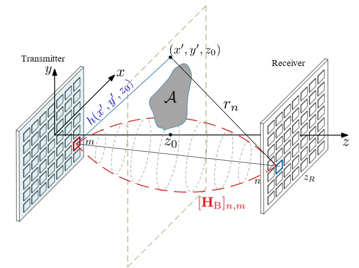

## About Me

I am a Postdoctoral Research Associate at University of California, Irvine.
I obtained by Ph.D. at Queen Mary University of London. 
I graduated from Peking University, obtained B.S. degree in Physics and in Computer Science.
I also love to play the piano. [See my BiliBili Channel here](https://space.bilibili.com/430062675).

## Research Interests

- multiple-input and multiple-output (MIMO), Reconfigurable Intelligent Surfaces (RIS), physical channel modelling, signal processing

## News

- **[May. 2024]** I received [The IEEE Communications Society Heinrich Hertz Award for Best Communications Letter](https://www.comsoc.org/about/awards/paper-awards/ieee-communications-society-heinrich-hertz-award-best-communications)!

- **[Aug. 2023]** I joined UC-Irvine as a Postdoctoral Researcher. I work with Professor [A. Lee Swindlehurst](https://engineering.uci.edu/users/lee-swindlehurst) in the area of MIMO wireless communication.

- **[Aug. 2022]** Our recent work with Professor Octavia A. Dobre has been featured in the IEEE Xplore homepage and been listed as the Top 1 [Popular Paper in IEEE CL](https://ieeexplore.ieee.org/xpl/RecentIssue.jsp?punumber=4234).

## Research Projects

- **Physically-Consistent Channel Modeling for MIMO Arrays**
  

- **STAR-RISs: Simultaneous Transmitting and Reflecting Reconfigurable Intelligent Surfaces**
   
  <strong><i style="color:#009900">J. Xu</i></strong>, Y. Liu, X. Mu, and, O. A. Dobre
   
  IEEE Communications Letters.
   
  [[Arxiv](https://arxiv.org/abs/2101.09663)] [[IEEE](https://ieeexplore.ieee.org/document/9437234)] <strong><i style="color:#e74d3c">Top 1 listed popular article in IEEE Commun. Lett.</i></strong>

- **STAR-RISs: A Correlated T&R Phase-Shift Model and Practical Phase-Shift Configuration Strategies**
   
  <strong><i style="color:#009900">J. Xu</i></strong>, Y. Liu, X. Mu, R. Schober, and, H. V. Poor
   
  IEEE Journal of Selected Topics in Signal Processing.
   
  [[Arxiv](https://arxiv.org/abs/2108.06233)] [[IEEE](https://ieeexplore.ieee.org/document/9774942)]

- **A Novel Physics-based Channel Model for Reconfigurable Intelligent Surface-assisted Multi-user Communication Systems**
   
  <strong><i style="color:#009900">J. Xu</i></strong>, and Y. Liu
   
  IEEE Transaction on Wireless Communications.
   
  [[Arxiv](https://arxiv.org/abs/2008.00619)] [[IEEE](https://ieeexplore.ieee.org/document/9512512)]

- **Simultaneously Transmitting and Reflecting Intelligent Omni-Surfaces: Modeling and Implementation**
   
  <strong><i style="color:#009900">J. Xu</i></strong>, Y. Liu, X. Mu, J. T. Zhou, L. Song, H. V. Poor, L. Hanzo
   
  IEEE Vehicular Technology Magazine.
   
  [[Arxiv](https://arxiv.org/abs/2108.06233)] [[IEEE](https://ieeexplore.ieee.org/document/9754364)] <strong><i style="color:#e74d3c">Popular article on IEEE Vehicular Tech. Mag.</i></strong>
  
- **Simultaneously Transmitting and Reflecting (STAR)-RISs: Are They Applicable to Dual-Sided Incidence?**
   
  <strong><i style="color:#009900">J. Xu</i></strong>, X. Mu, J.T. Zhou, and Y. Liu
   
  IEEE Communications Letters.
   
  [[Arxiv](https://arxiv.org/pdf/2209.05317.pdf)] [[IEEE](https://ieeexplore.ieee.org/abstract/document/9935303)]

- **Reconfigurable intelligent surfaces: Principles and opportunities**
   
  Y. Liu, X. Liu, X. Mu, T. Hou, <strong><i style="color:#009900">J. Xu</i></strong>, M. Di Renzo, and N. Al-Dhahir
   
  IEEE Communications Surveys and Tutorials.
   
  [[Arxiv](https://arxiv.org/abs/2007.03435)] [[IEEE](https://ieeexplore.ieee.org/document/9424177)] <strong><i style="color:#e74d3c">ESI Highly Cited Paper, Popular article on IEEE COMST, IEEE best readings on RIS</i></strong>

- **STAR: Simultaneous Transmission and Reflection for 360° Coverage by Intelligent Surfaces**
   
  Y. Liu, X. Mu, <strong><i style="color:#009900">J. Xu</i></strong>, R. Schober, Y. Hao, H. V. Poor, and L. Hanzo
   
  IEEE Wireless Communication.
   
  [[Arxiv](https://arxiv.org/abs/2103.09104)] [[IEEE](https://ieeexplore.ieee.org/document/9690478)] <strong><i style="color:#e74d3c">Popular article on IEEE Wireless Commun. Mag.</i></strong>

- **SEAD counter: Self-adaptive counters with different counting ranges**
   
  X. Liu, Y. Xu, P. Liu, T. Yang,  <strong><i style="color:#009900">J. Xu</i></strong>, L. Wang, G. Xie, X. Li, S. Uhlig
   
  IEEE/ACM Transactions on Networking. [[IEEE](https://ieeexplore.ieee.org/abstract/document/9537736)]

## Attended Conferences

- **Performance Analysis for the Coupled Phase-Shift STAR-RISs**
   
  <strong><i style="color:#009900">J. Xu</i></strong>, Y. Liu, and X. Mu
   
  2022 IEEE Wireless Communications and Networking Conference (WCNC).

- **Reconfigurable Intelligent Surface-assisted Networks: Phase Alignment Categories**
   
  <strong><i style="color:#009900">J. Xu</i></strong>, Y. Liu, and X. Mu
   
  ICC 2021-IEEE International Conference on Communications.

- **A Novel Channel Model for Reconfigurable Intelligent Surface-assisted Wireless Networks**
   
  <strong><i style="color:#009900">J. Xu</i></strong> and Y. Liu
   
  GLOBECOM 2020-2020 IEEE Global Communications Conference.

- **Fast Beam Splitting Technique for STAR-RISs with Coupled T&R Phase Shifts**
   
  Y. Liu, <strong><i style="color:#009900">J. Xu</i></strong>, and X. Mu
   
  2022 3rd URSI Atlantic and Asia Pacific Radio Science Meeting (AT-AP-RASC).

- **Joint beamforming optimization for simultaneously transmitting and reflecting (STAR) RIS aided communications**
   
  X. Mu, Y. Liu, <strong><i style="color:#009900">J. Xu</i></strong>, L. Guo, and J. Lin
   
  2021 55th Asilomar Conference on Signals, Systems, and Computers.

- **A generic technique for sketches to adapt to different counting ranges**
   
  T. Yang, <strong><i style="color:#009900">J. Xu</i></strong>, et. al.
   
  IEEE INFOCOM 2019-IEEE Conference on Computer Communications.

  
## Services

- Journal Reviewer: IEEE transactions on communication, transactions on wireless communication,
 journal of selected topics in signal processing, communication letters, wireless communication letters, transactions on green communications and networking.
- Conference Reviewer: IEEE Globecom, ICC, WCNC.
